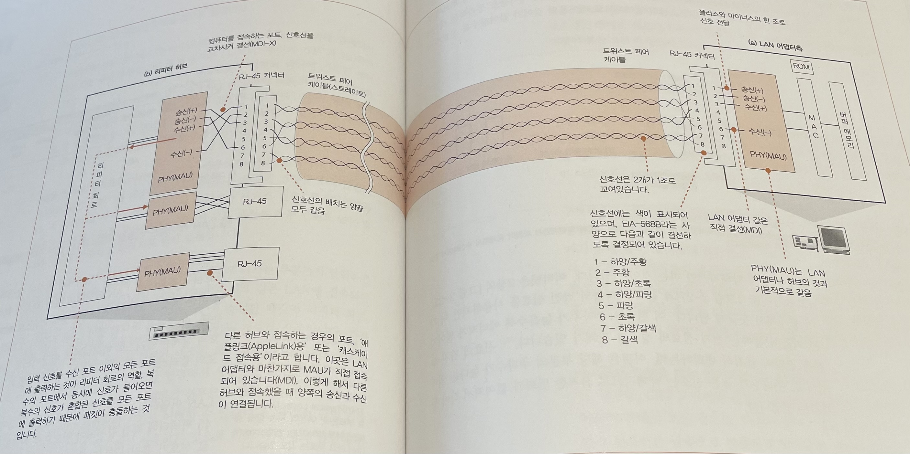
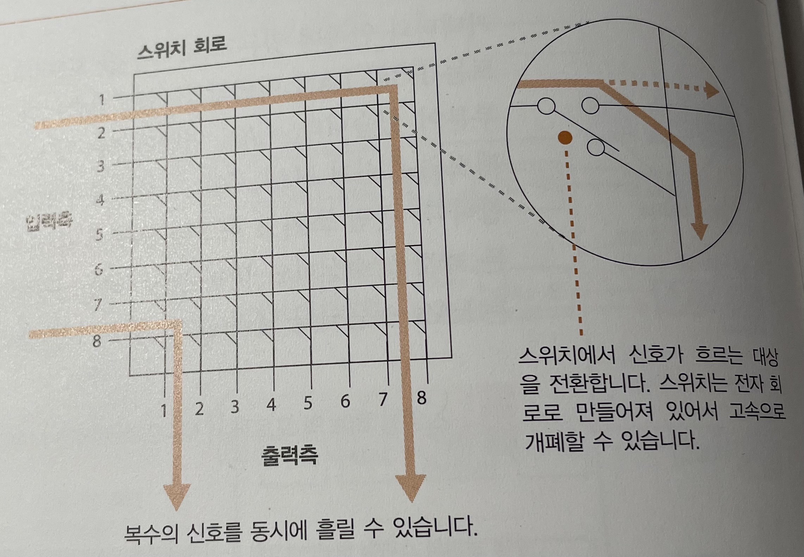

# STORY 01 케이블과 리피터, 허브 속을 신호가 흘러간다

## 1. 하나하나의 패킷이 독립된 것으로 동작한다

- 컴퓨터에서 송신된 패킷은 허브나 라우터라는 중계 장치에 의해 목적지로 도달한다.
    - 패킷 헤더의 제어정보와 중계 장치가 관리하는 정보를 비교하여 중계한다.
- 내용의 예시는 ‘클라이언트 PC - 리피터 허브 - 스위칭 허브 - 라우터’ 의 구조(LAN) 로 되어 있다고 가정하여 설명한다.
    - 일반 가정집에서는 위와 같이 단일 기능의 기기들로 연결되어 있는 형태보다는 복합 기능을 수행하는 기기로 이루어진 경우가 많다.

## 2. LAN 케이블은 신호를 약화시키지 않는 것이 핵심이다

- LAN 케이블은 전기 신호를 다음 중계 장치에게 전달한다.
    - RJ-45 커넥터의 두 개의 신호가 하나의 전기 신호 쌍이다.
        - 하나는 + 신호를, 하나는 - 신호를 보낸다.
    - 두 개의 신호선은 꼬여있는 상태로 구성되어 있다. (트위스트 페어 케이블)
- 송출한 신호는 다음 중계 장치에 도착할 때에는 조금 약해져 있다.
    - 케이블의 길이가 길어질 수록 신호가 약해진다.
    - 디지털 데이터는 사각형의 각진 신호이지만, 전기 신호는 완만한 그래프 형태이다.
        - 주파수가 높을 수록 전기 신호로 변환하는 과정에서 데이터의 변형이 크다.
    - 잡음이 있을 경우 신호의 파형이 왜곡된다.
- 변형된 신호를 디지털 신호로 변환하는 과정에서 잘못 판독하여 통신 오류가 발생할 수 있다.
- LAN 케이블은 이러한 경우를 방지하기 위해 신호선을 꼬아놓은 상태로 관리한다.

## 3. ‘꼼’ 은 잡음을 방지하기 위한 방법이다

- 잡음은 외부의 전자파에 의해 발생할 수 있다.
    - 전자파는 금속 등의 도전체에 닿으면 전류를 발생시키는 성질이 있다.
        - 모니터, 형광등, CRT 모니터 등에서 전자파가 발생할 수 있다.
    - LAN 케이블의 신호선은 금속으로 이루어져 있어 주변에 전자파가 있을 경우 또 다른 전기 신호가 발생하여 잡음이 생길 수 있다.
    - 전자파로 인해 생긴 전류를 상쇄하기 위해 신호선을 꼬아서 관리한다.
        - 전자파로 생긴 전류는 왼쪽에서 오른쪽으로 흐른다는 성질이 있다.
        - 오른쪽에서 왼쪽으로 흐르는 전기 신호에 닿으면 잡음이 상쇄된다.
        - 꼬임의 간격이 좁을 수록 효과가 좋다.
- 잡음은 내부의 신호선에서 발생한 전자파에 의해 발생할 수 있다.
    - 신호선 안에 전류가 흐르므로 전류에 의해 주위에 전자파가 발생할 수 있다. (crosstalk)
    - 매우 가까이에서 발생한 전자파를 상쇄하기 위해 꼬임의 간격을 다양하게 관리한다.
        - 꼬임의 간격이 다르면 어떤 경우에는 플러스 신호가 가깝고, 어떤 경우에는 마이너스 신호가 가깝다.
        - 플러스와 마이너스의 경우 잡음의 영향이 반대가 되어 균형이 잡히면서 잡음의 영향이 줄어든다.
    - 신호선 사이에 구분판이나 피복을 입히는 등의 방법도 있다.

## 4. 리피터 허브는 연결되어 있는 전체 케이블에 신호를 송신한다

- LAN 케이블을 통해 리피터 허브에 신호가 들어온다.
    - PHY(MAU) 회로는 송신 단자와 수신 단자가 구분되어 있다.
    - 송신 단자로 들어온 신호는 수신 단자로 수신해야 한다.
    - 허브의 경우 커넥터 사이의 구성이 적절하도록 설정해야 한다.
        - 허브의 커넥터는 MDI/MDI-X 로 구분된다.
            - MDI : RJ-45 커넥터와 신호 송수신 회로를 직접 결선한 것
            - MDI-X : MDI 를 교차하여 결선한 것
        - 허브 사이의 연결 시 MDI 와 MDI-X 끼리 연결해야 하며, 종류가 같을 경우 크로스 케이블을 사용해야 한다.
    - PC 의 경우 크로스 케이블을 사용해야 한다.
        - 두 개의 PC 를 직접 케이블로 연결할 경우 송수신 단자의 위치가 동일하므로 크로스 케이블을 사용해야 한다.
- 리피터 허브에서 PHY(MAU) 회로의 수신부에 도달한 신호는 리피터 회로에 들어간다.
    - 리피터 회로는 리피터 허브의 커넥터 부분에 뿌리는 역할을 한다.
        - 제품에 따라 신호의 파형을 다듬고 오류를 억제하는 제품도 있다.
    - 모든 커넥터에 신호가 나가면 리피터 허브에 접속한 전체 기기에 도달한다.

# STORY 02 스위칭 허브의 패킷 중계 동작

## 1. 스위칭 허브는 주소 테이블로 중계한다

- LAN 어댑터와는 달리 스위칭 허브는 자신의 MAC 주소를 검사하지 않기 때문에 스위칭 허브의 포트에는 MAC 주소가 할당되어 있지 않다.
    - 스위칭 허브는 접근한 모든 패킷을 수신한다.
    - PHY(MAU) 회로에 들어온 신호를 MAC 회로가 받아 디지털 신호로 변환한다.
    - 디지털로 신호 변환 후 FCS 를 대조하여 오류 검사 후 버퍼 메모리에 저장한다.
- 스위칭 허브는 이더넷의 패킷을 그대로 목적지로 중계하도록 설계되었다.
- 스위칭 허브에서 관리하는 MAC 표를 이용하여 목적지 MAC 주소에 연결되어 있는 포트를 찾아 해당 경로로 신호를 송신한다.
    - 스위치 회로를 이용하여 적절한 포트에게 신호를 전달한다.
        - 스위치 회로는 입력측(수신측)과 출력측(송신측)으로 나누어져 있다.

      

        - MAC 주소에 연결되어 있는 포트에 도달하면 스위치 값을 변경하여 신호를 전달한다.
    - 각 스위치는 독립적이므로 신호가 중복되지 않는다면 여러 개의 신호가 동시에 흐를 수 있다.
    - 송신 측의 포트에 패킷을 운반하면 MAC 회로나 PHY(MAU) 회로가 송신 동작을 실행하고 케이블에 신호가 흘러간다.
        - 앞전의 송신 동작이 끝나거나 아무도 송신하지 않을 경우에 송신한다.
        - 소켓을 디지털 데이터에서 신호로 변환하여 송신한다.

## 2. MAC 주소 테이블을 등록 및 갱신한다

- MAC 주소 테이블은 자동으로 데이터를 관리하여 직접 갱신할 필요가 없다.
- MAC 주소 테이블의 정보를 등록한다.
    - 패킷을 수신했을 경우 송신처 MAC 주소와 수신한 포트 번호 정보를 등록한다.
- MAC 주소 테이블의 정보를 삭제한다.
    - 연결 정보가 변경되었을 경우를 위해 일정 시간(약 몇 분)이 지나면 정보를 삭제한다.

## 3. 예외적인 동작

- 스위칭 허브는 패킷을 수신한 포트와 송신하는 포트가 같을 경우 패킷을 폐기한다.
    - 두 개의 PC 가 하나의 리피터 허브에 연결되어 있고, 리피터 허브가 스위칭 허브에 연결되어 있는 경우 발생할 수 있다.
    - A PC 가 리피터 허브에게 송신하고, 리피터 허브는 B PC 와 스위칭 허브에게 송신한다.
    - 스위칭 허브는 MAC 주소 테이블을 조사하니 수신한 포트와 송신한 포트가 리피터 허브로 같아 동일한 곳에 송신한다.
    - 리피터 허브는 A PC 와 B PC 에게 송신한다.
    - 즉, B PC 는 동일한 요청을 두 번 받을 수 있기 때문에 송수신 포트가 같을 경우 폐기한다.
- MAC 주소 테이블에 송신할 기기 정보가 없을 경우 연결된 모든 포트에게 요청한다.
    - 수신한 포트 외에 모든 포트에게 패킷을 송신하여 송신할 기기의 MAC 주소를 조사한다.
    - 받아온 정보를 MAC 주소 테이블에 갱신한다.

## 4. 전이중 모드에서 송신과 수신을 동시에 실행한다

- 리피터 허브는 반이중 모드이기 때문에 송수신 동작을 동시에 수행할 수 없다.
- 하지만 리피터 허브를 제외하고는 송수신 동작이 별개로 처리된다.
    - 트위스트 페어 케이블의 신호선은 송신용과 수신용이 분리되어 있다.
    - PHY(MAU) 회로와 MAC 회로의 내부도 송신 단자와 수신 단자가 나누어져 있다.
- 성능 향상을 위해 송수신 동작을 동시에 실행할 수 있는 전이중 모드가 생겼다.
    - 신호의 충돌을 검출하는 회로가 무효화된 것이 전이중 모드이다.

## 5. 최적의 전송 속도로 보내는 자동 조정

- 전이중 모드가 등장함에 따라 기존의 반이중 모드에서 전이중 모드로 자동으로 전환하는 기능이 추가되었다.
- 또한, 상대의 전송 속도를 검출하여 전송 속도 또한 자동으로 전환할 수 있다. ⇒ 자동 조정
- 이더넷은 데이터가 흐르고 있지 않을 때 링크 펄스가 흐르는데 이를 이용한다.
    - 홀수 번째 펄스는 신호의 타이밍을 잡기 위한 것으로 일정 간격으로 송신한다.
    - 짝수 번째 펄스는 의미가 담긴 신호로, 이를 해석하여 정보를 얻는다.
- 연결 되어 있는 기기에게 링크 펄스를 보내 상대방에게 자신이 지원할 수 있는 정보를 전달한다.
- 미리 정의되어 있는 우선순위 기준으로 양측이 모두 해당하는 가장 높은 우선순의 정보가 선택된다.
    - 전송 속도가 모드 선택보다 우선순위가 높다.
    - 전송 속도는 빠를 수록 우선순위가 높다.
    - 전이중 모드가 반이중 모드보다 우선순위가 높다.

## 6. 스위칭 허브는 복수의 중계 동작을 동시에 실행한다

- 스위칭 허브는 송신 포트 한 곳에만 패킷을 송신하기 때문에 여러 개의 패킷을 한번에 중계할 수 있다.
